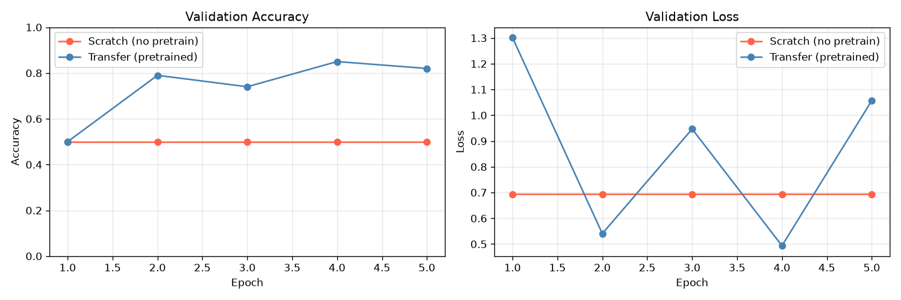

# 05주차 2번 과제 — VGG16 전이 학습 실험 보고서

---

## 대화 기록 (과제 수행 맥락)

> **Q.** AI 모델 과제 수행 중. 1번은 완료했고 2번 차례인데, 샘플 이미지 데이터는 어디서 수집하는 게 좋을지 추천해줘.
>
> **A.** 1번과 같은 데이터셋(dog/cat/etc)을 사용하면 3번 비교 과제까지 한 번에 해결 가능. 새 데이터셋을 원한다면 Kaggle Flowers, OxfordIIITPet, 또는 `torchvision.datasets`로 자동 다운로드 추천.
>
> **Q.** 1번 데이터셋은 개/고양이/기타로 이뤄진 10개 아래의 소규모 데이터셋이야.
>
> **A.** 데이터를 보충하는 방향(B안)을 추천. 기존 클래스 유지하면서 이미지 추가 + Data Augmentation 병행 제안.
>
> **Q.** 전이 학습 전후의 결과는 어떻게 판별할 수 있을까?
>
> **A.** ① Val Accuracy 최종값 비교 ② 에폭별 학습 곡선 ③ Train/Val accuracy gap(과적합 정도) 세 축으로 비교.
>
> **Q.** 실험까지 진행하는데 실험 전후의 테스트를 반드시 실행하고 차이를 기록해줘. 리포트는 Markdown, 간결하게 두괄식, 이 대화 기록도 서두에 포함.
>
> *(OxfordIIITPet 시도 → 로컬 CPU에서 다운로드 60분+ 예상 → CIFAR-10으로 교체)*
>
> **Q.** 학습 전에도 테스트를 실행했어야 했던 거 아니야?
>
> **A.** 맞음. 학습 전/후 테스트를 모두 포함하도록 스크립트 수정 후 재실행.

---

## 실험 이해 요약

- **Scratch**: VGG16 구조만 사용, 가중치는 랜덤 초기화 상태로 학습 시작
- **Transfer**: ImageNet(IMAGENET1K_V1)으로 사전 학습된 가중치를 가져오되, **conv 레이어는 동결(freeze)하고 마지막 FC 레이어만 새 데이터로 fine-tuning**
  - 단순히 "학습된 모델을 그대로 테스트"한 것이 아니라, 기존 피처 추출 능력은 유지하면서 분류기만 새 태스크에 맞게 조정한 것이 핵심
- **결론**: 소규모 데이터에서 Scratch는 학습 자체가 실패하며, 전이 학습은 범용 피처(ImageNet conv)를 재활용해 적은 데이터로도 새 태스크에 빠르게 적응한다

---

## Summary

> **전이 학습(Transfer)이 소규모 데이터에서 압도적으로 유효하다.**
> Scratch 모델은 200개 훈련 샘플로 학습 자체가 실패(50% = 랜덤 수준)했으나,
> Transfer 모델은 학습 전부터 67% 정확도를 보였고 학습 후 73%까지 향상됐다.

---

## 실험 환경

| 항목 | 내용 |
|---|---|
| 데이터셋 | CIFAR-10 (cat=3, dog=5 클래스 추출, 이진 분류) |
| 훈련/검증/테스트 | 200 / 50 / 50 (클래스당) |
| 모델 | VGG16 |
| 옵티마이저 | Adam (lr=1e-3) |
| 에폭 | 5 |
| 배치 크기 | 32 |
| 디바이스 | CPU |

**Scratch**: `VGG16(weights=None)` — 전체 파라미터 랜덤 초기화, FC 레이어만 2클래스 출력으로 교체  
**Transfer**: `VGG16(weights=IMAGENET1K_V1)` — conv 레이어 동결(freeze), FC 마지막 레이어만 교체 후 fine-tuning

---

## 실험 결과

### 테스트 정확도 (학습 전 vs 학습 후)

|  | Scratch | Transfer |
|---|---|---|
| **학습 전 (Before Training)** | 56.0% | **67.0%** |
| **학습 후 (After Training)** | 50.0% | **73.0%** |
| **변화** | -6.0%p (퇴화) | **+6.0%p** |
| **학습 시간** | 527s | **208s** (2.5배 빠름) |

### 에폭별 Val Accuracy

| Epoch | Scratch | Transfer |
|---|---|---|
| 1 | 50.0% | 50.0% |
| 2 | 50.0% | 79.0% |
| 3 | 50.0% | 74.0% |
| 4 | 50.0% | 85.0% |
| 5 | 50.0% | 82.0% |

### 학습 곡선

---

## 분석

### Scratch 모델이 학습에 실패한 이유
- 랜덤 초기화된 VGG16(16 레이어)은 깊은 네트워크 특성상 소규모 데이터에서 gradient 흐름이 불안정
- 1 에폭 train_loss=27.45 (정상 범위 ~0.69)로 시작 → 이후 0.693에 고착 = 한 클래스만 예측하는 상태
- 200개 샘플로는 16개 레이어의 수백만 파라미터를 학습시키기에 극히 부족

### Transfer 모델의 강점
- **학습 전부터 67%**: ImageNet에서 학습된 conv 피처가 cat/dog 구분에 바로 유효
- **빠른 수렴**: 동결된 conv 레이어로 backprop 연산 감소 → 527s → 208s
- **val_acc 진동**: 소규모 데이터셋(50개)의 분산이 커서 epoch마다 0.74~0.85 사이를 오감 → 더 많은 데이터 또는 lr 조정으로 개선 가능

---

## 결론 및 시사점

소규모 데이터에서는 **전이 학습이 필수**에 가깝다. Scratch 학습은 데이터가 충분하지 않으면 수렴 자체가 실패한다. 사전 학습된 모델은 학습 없이도 의미 있는 피처를 보유하며, fine-tuning으로 도메인 특화까지 달성할 수 있다.
