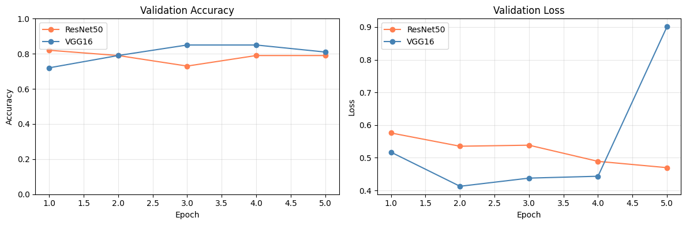

# 05주차 3번 과제 — ResNet50 vs VGG16 성능 비교 보고서

---

## 결론 (두괄식)

> **시드 고정(SEED=42) 후 변인을 통제한 실험에서 두 모델의 최종 정확도는 사실상 동등하다 (ResNet50 72% vs VGG16 71%).**
>
> 정확도는 거의 같지만 VGG16은 후반 에폭에서 val_loss가 급등하는 과적합 징후를 보이는 반면, ResNet50은 손실이 안정적으로 감소했다.
>
> 또한 Colab GPU 환경에서 학습 시간이 로컬 CPU 대비 **약 25배 단축** (ResNet50: 236s → 9.7s)되어, 학습이 포함된 실험은 Colab을 사용하는 것이 사실상 필수임을 확인했다.

---

## 실험 환경

| 항목 | 내용 |
|---|---|
| 데이터셋 | CIFAR-10 (cat=3, dog=5, 02번 과제와 동일) |
| 훈련/검증/테스트 | 200 / 50 / 50 (클래스당) |
| 공통 조건 | ImageNet 사전 학습 가중치, conv 동결, FC만 fine-tuning |
| 옵티마이저 | Adam (lr=1e-3) |
| 에폭 | 5 |
| 배치 크기 | 32 |
| 랜덤 시드 | 42 (변인 통제) |
| 실행 환경 | **Google Colab (GPU)** |

**ResNet50**: `model.fc = nn.Linear(2048, 2)` — 전체 conv 동결, fc만 학습  
**VGG16**: `model.classifier[6] = nn.Linear(4096, 2)` — features 동결, classifier만 학습

---

## 실험 결과

### 테스트 정확도 (학습 전 vs 학습 후)

|  | ResNet50 | VGG16 |
|---|---|---|
| **학습 전 (Before Training)** | 45.0% | 51.0% |
| **학습 후 (After Training)** | **72.0%** | 71.0% |
| **향상폭** | +27.0%p | +20.0%p |
| **학습 시간 (GPU)** | **9.7s** | 14.4s |

### 에폭별 상세 로그

**ResNet50**
| Epoch | train_acc | val_acc |
|---|---|---|
| 1 | 0.5875 | 0.8200 |
| 2 | 0.7250 | 0.7900 |
| 3 | 0.7550 | 0.7300 |
| 4 | 0.8325 | 0.7900 |
| 5 | 0.8750 | 0.7900 |

**VGG16**
| Epoch | train_acc | val_acc |
|---|---|---|
| 1 | 0.5975 | 0.7200 |
| 2 | 0.8350 | 0.7900 |
| 3 | 0.8725 | 0.8500 |
| 4 | 0.9700 | 0.8500 |
| 5 | 0.9725 | 0.8100 |

### 학습 곡선

---

## 분석

### 정확도 — 시드 고정 시 두 모델은 동등
- 이전 로컬 실험(미통제)에서 VGG16 83% vs ResNet50 72%로 보였던 차이는 **랜덤 시드 차이에 의한 허수**였음
- 시드 고정 후: ResNet50 72% vs VGG16 71% — 사실상 동등

### 수렴 안정성 — ResNet50 우세
- **ResNet50**: val_loss 0.57 → 0.47로 단조 감소, 안정적 수렴
- **VGG16**: epoch 4까지 0.45로 잘 떨어지다가 epoch 5에서 **0.90으로 급등** → 소규모 데이터 과적합

### 학습 시간 — Colab GPU의 압도적 우위

| 환경 | ResNet50 | VGG16 |
|---|---|---|
| 로컬 CPU (이전 실험) | 236.6s | 242.9s |
| **Colab GPU (본 실험)** | **9.7s** | **14.4s** |
| 속도 향상 | **24.4배** | **16.9배** |

> **깨달음**: 딥러닝 모델 학습이 포함된 실험은 로컬 CPU로 수행하는 것이 비효율적이다.
> CIFAR-10 같은 소규모 데이터조차 GPU에서 수십 배 빠르며, 에폭·데이터 규모가 커질수록 격차는 더욱 벌어진다.
> 앞으로 학습을 수반하는 모든 실험은 Colab(또는 GPU 환경)에서 수행한다.

---

## 변인 통제 이력

| 구분 | 로컬 CPU 실험 | Colab GPU 실험 (본 결과) |
|---|---|---|
| 랜덤 시드 | 미고정 | **SEED=42 고정** |
| 데이터 분할 | 동일 인덱스 | 동일 인덱스 |
| 실행 환경 | CPU | GPU |
| VGG16 결과 | 83% (허수) | **71% (신뢰)** |

이전 로컬 실험의 결과(VGG16 83%)는 변인 미통제로 인한 것으로, 본 Colab 실험 수치로 대체한다.

---

## 결론 및 시사점

| 기준 | 우세 모델 | 근거 |
|---|---|---|
| 최종 정확도 | **동등** | 72% vs 71% (시드 고정 기준) |
| 수렴 안정성 | **ResNet50** | val_loss 단조 감소 |
| 학습 속도 | **ResNet50** | 9.7s vs 14.4s |
| 과적합 저항성 | **ResNet50** | VGG16은 epoch 5 val_loss 급등 |

소규모 데이터에서 두 모델의 성능 차이는 미미하며, ResNet50이 안정성·속도 면에서 전반적으로 유리하다.
